# Study Earn – Applicazione mobile per lavori temporanei per studenti

## A. Informazioni sullo studente

* **Nome:** Mohamed Chiha
* **Matricola:** 341632

---

## B. Titolo del progetto

**Study Earn – Applicazione mobile per lavori temporanei per studenti**

---

## C. Descrizione del progetto

L’app **Study Earn** è un’applicazione mobile sviluppata con **Flutter**.
Il suo obiettivo principale è **facilitare la ricerca di lavori temporanei per studenti**.

L’app mette in collegamento:

* **Studenti in cerca di lavori flessibili**
* con **datori di lavoro o piccoli imprenditori** che necessitano di assistenza per un numero limitato di ore e con compenso stabilito.

L’app offre una soluzione **semplice, facile da usare ed efficace** che soddisfa le esigenze di entrambe le parti: studenti e datori di lavoro.

---

## D. Esperienza utente (User Experience)

### Schermata di scelta del ruolo (Scelta del Ruolo)

Dopo le schermate introduttive (Onboarding), appare la **pagina di scelta del ruolo**.
Qui l’utente deve **selezionare uno dei due ruoli**:

* **Studente:** per chi cerca lavoro
* **Datore di Lavoro:** per chi offre opportunità lavorative

---

### Registrazione e accesso (Registrazione e Accesso)

Dopo la scelta del ruolo:

* Se l’utente sceglie **Datore**, viene indirizzato a una pagina di login o creazione account dedicata ai datori di lavoro, per gestire le proprie offerte.
* Se l’utente sceglie **Studente**, viene indirizzato a una pagina di login o creazione account dedicata agli studenti, per creare il profilo e candidarsi alle offerte.

---

### Navigazione all’interno dell’app (Navigazione)

Dopo il login, l’app mostra un’interfaccia diversa in base al ruolo:

* **Interfaccia Studente (Home Studente):** mostra le offerte di lavoro disponibili.
* **Interfaccia Datore (Home Datore):** permette di aggiungere nuove offerte e gestire quelle esistenti.

---

### Candidatura e gestione dei lavori (Candidatura e Gestione Lavori)

Gli studenti possono sfogliare le offerte presentate come **card dettagliate**.

* Cliccando su un’offerta è possibile vedere i requisiti.

---

### Screenshot

est que commentaire de chaque photo vrai en langue italien, voligo comentaire simple court sensa pronomi , solo parole : <table>
  <tr>
    <td align="center">
      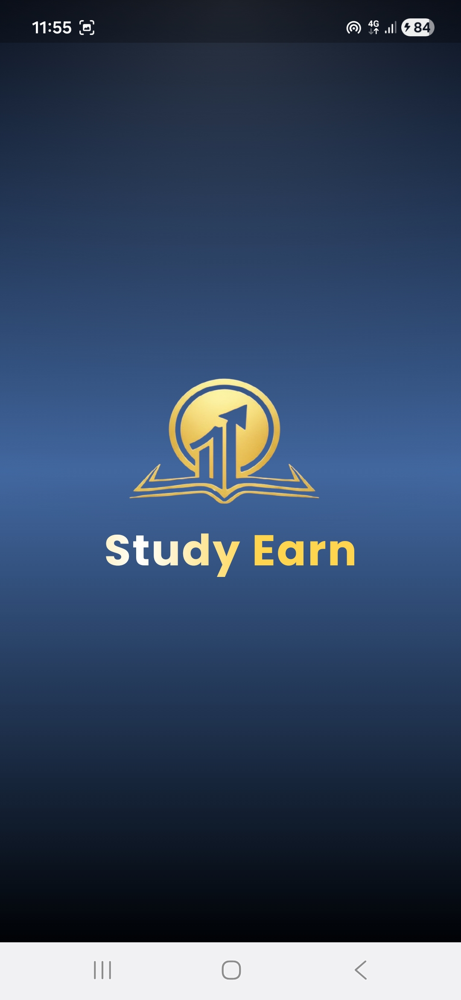 
      pagina splash
    </td>
    <td align="center">
      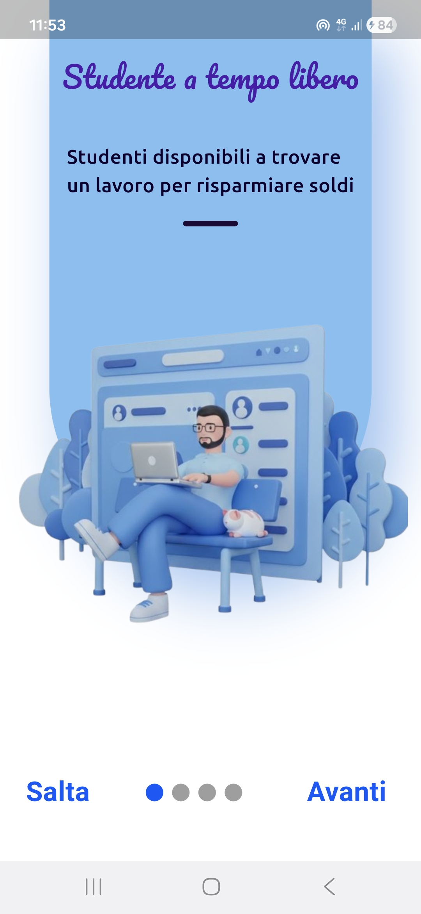 
      prima pagine introduttive
    </td>
    <td align="center">
      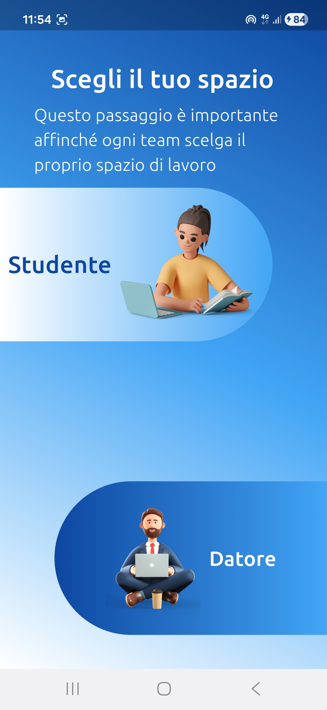 
      Pagina scelta ruolo
    </td>
    <td align="center">
      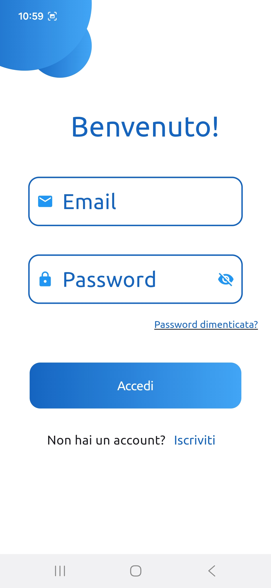 
      pagina login utente
    </td>
       <td align="center">
      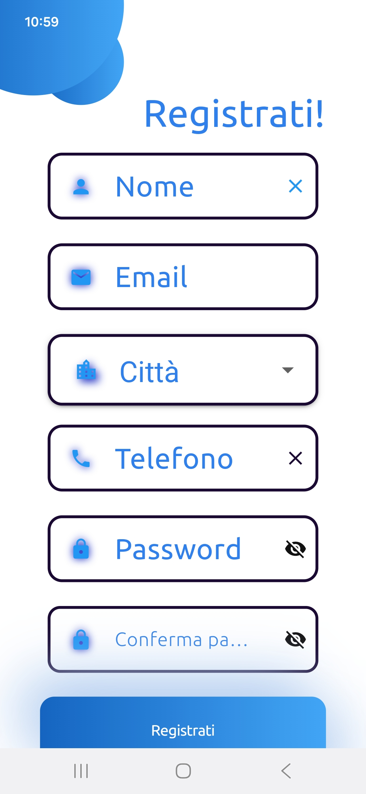 
      pagina registrazione utente
      </td>
  </tr>

  <tr>
    <td align="center">
      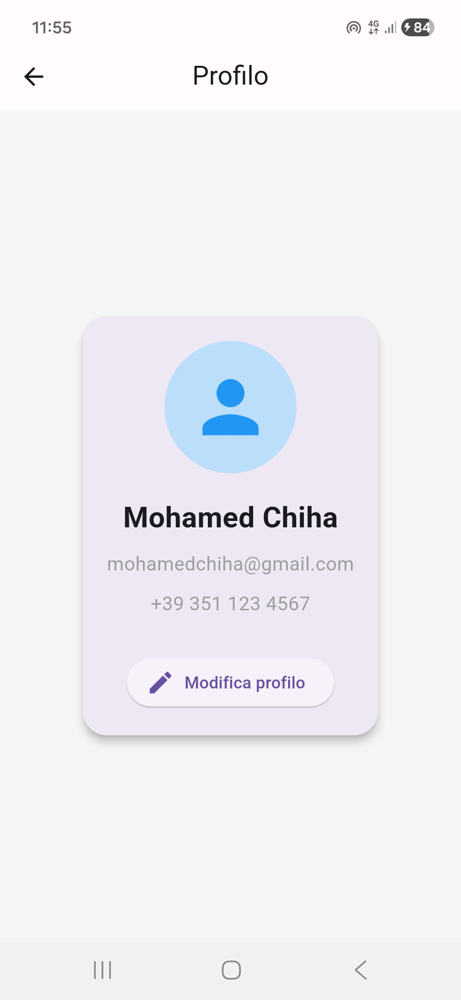 
      pagina profilo utente
    </td>
    <td align="center">
      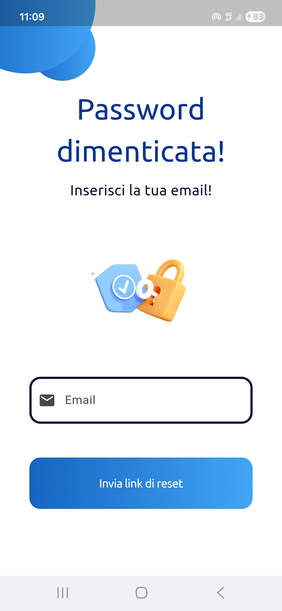 
      pagina dimenticata password
    </td>
    <td align="center">
      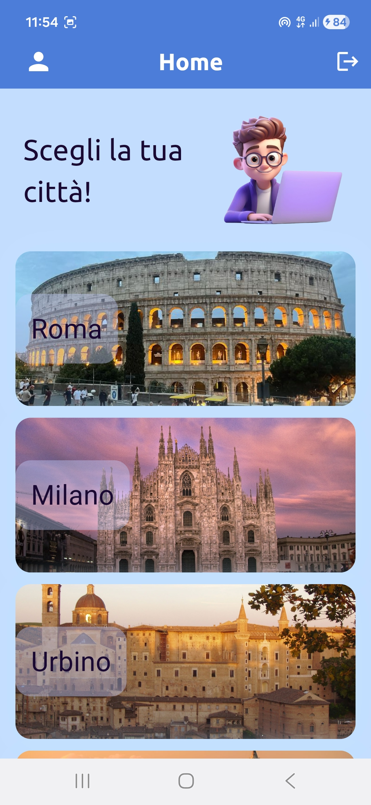 
      pagina home studente
    </td>
    <td align="center">
      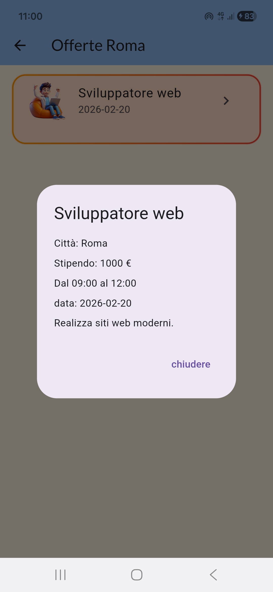 
      pagina offerta studente
    </td>
    <td align="center">
      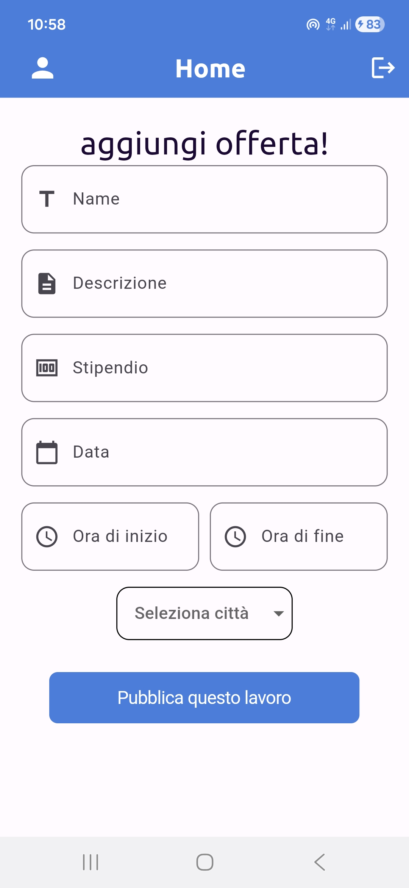 
      pagina home datore
    </td>
  </tr>
  <tr>
    <td>
      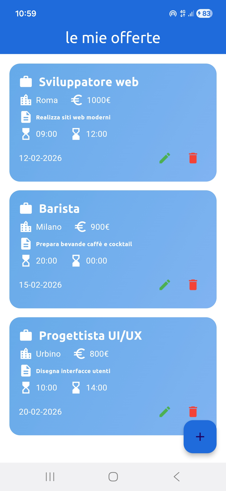 
      pagina offerta datore
    </td>
  </tr>
</table>
  

## E. Tecnologia e implementazione (Tecnologia e Implementazione)

### Uso di Flutter e Dart

L’app è sviluppata con **Flutter** e **Dart**, offrendo un’esperienza fluida e prestazioni elevate su **Android** usando **un solo codice sorgente**.

---

### Pacchetti Flutter utilizzati (Pacchetti Flutter Utilizzati)

Per migliorare l’interfaccia e le funzionalità, sono state utilizzate diverse librerie:

* **google_fonts:** per aggiungere font moderni ed eleganti
* **gradient_borders:** per creare card e pulsanti con design sfumato e accattivante
* **shimmer:** per effetti di caricamento piacevoli (Skeleton Loading)
* **smooth_page_indicator:** per mostrare indicatori nelle schermate introduttive
* **dropdown_button2:** menu a tendina personalizzati nei moduli
* **intl:** gestione corretta di date e formati internazionali

---

### Gestione dello stato (State Management)

È stato utilizzato il sistema nativo di Flutter **`setState` e `StatefulWidget`** per gestire lo stato dell’app, semplificando il codice e rendendolo facile da leggere senza complessità aggiuntive.

---

### Archiviazione dati (Archiviazione Dati)

Attualmente l’app utilizza **dati temporanei in memoria (Mock Data)** per simulare il server, facilitando i test dell’interfaccia e del flusso di lavoro.
Nella versione finale, ciò può essere sostituito da un database locale o un servizio cloud come **Firebase**.

---

### Sfide implementative (Sfide Implementative)

* **Design responsive:** garantire la compatibilità di card e gradienti su tutti i formati di schermo, risolto con `LayoutBuilder`.
* **Flusso delle schermate introduttive (Onboarding Flow):** migliorato il passaggio tra schermata iniziale e registrazione per evitare ritorni indesiderati usando `Navigator.pushReplacement`.

---

Run with: flutter pub get then flutter run
